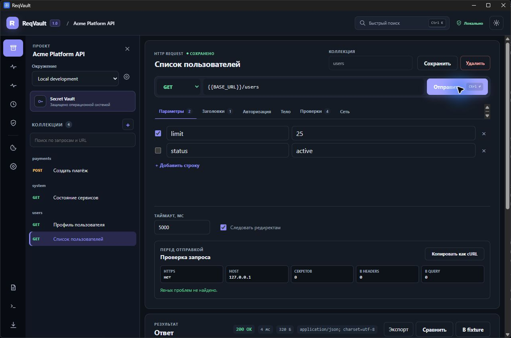
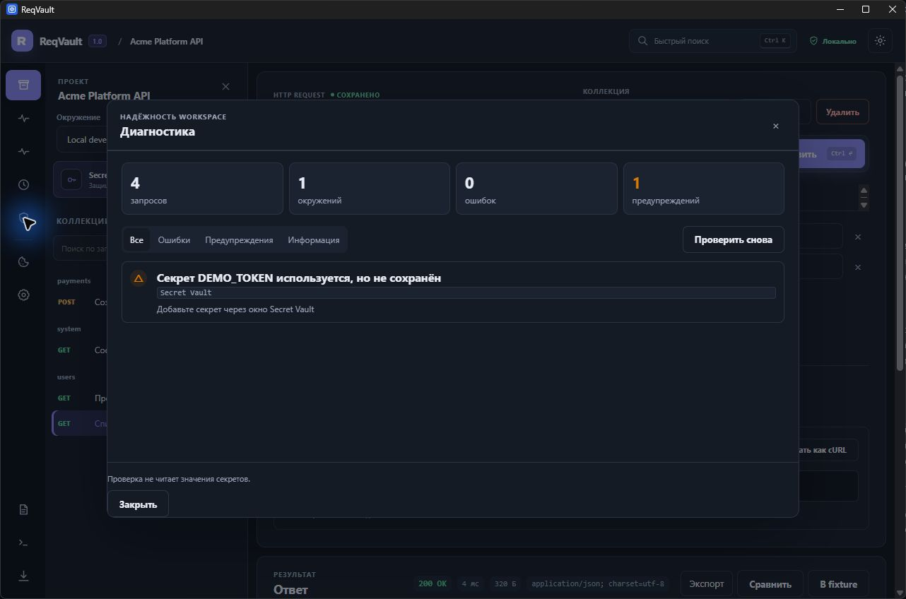

# ReqVault

ReqVault — локальный desktop-клиент для REST API. Он хранит запросы и окружения в понятных YAML-файлах, а токены и пароли — отдельно в защищённом хранилище операционной системы.

Проект не требует аккаунта, облачного сервиса или собственного backend. Workspace можно положить в Git и использовать в команде, не добавляя секреты в репозиторий.

**[Скачать ReqVault для Windows](https://github.com/pavel-duke/reqvault/releases/latest)** · [Первый запуск](docs/getting-started.md) · [Roadmap](docs/roadmap.md)

> ReqVault 1.0 — стабильная версия с новым интерфейсом и зафиксированным форматом workspace v1. Приложение работает локально и не требует регистрации.

## Как выглядит приложение



Запрос, окружение, настройки авторизации и ответ находятся в одном рабочем окне. Глобальные инструменты не забирают место у редактора.



Диагностика заранее находит ошибки YAML, отсутствующие переменные, секреты, сертификаты и multipart-файлы. Значения из Secret Vault не читаются и не попадают в отчёт.

## Возможности

- workspace в обычной папке: `reqvault.yaml`, `requests/**/*.yaml`, `environments/*.yaml`;
- методы GET, POST, PUT, PATCH, DELETE, HEAD и OPTIONS;
- query-параметры, заголовки, JSON, raw text, urlencoded и multipart с файлами;
- Bearer Token, Basic, Digest, API key, OAuth 2.0 и AWS Signature V4;
- Authorization Code с PKCE и Client Credentials;
- proxy, custom CA и mTLS с PEM-сертификатами;
- импорт Postman Collection 2.x, OpenAPI 3.x и Swagger 2.0 из JSON/YAML;
- импорт готовой команды cURL;
- локальные внешние `$ref` в OpenAPI;
- экспорт и импорт workspace одним `.reqvault.json` bundle-файлом без секретов;
- Production Guard: обязательный HTTPS, список разрешённых хостов, блокировка методов и секретов в URL;
- автоматическое обновление OAuth access token по refresh token после ответа `401`;
- проверки HTTP status, заголовков, JSON path, тела и времени ответа;
- последовательный запуск всех запросов или выбранной коллекции;
- отдельный `reqvault-cli` для локальных проверок и CI;
- JSON-отчёт и предсказуемые exit code CLI;
- отдельный GraphQL body с query, variables и operation name;
- автоматическое распознавание GraphQL при импорте cURL;
- отдельное отображение GraphQL `errors` в ответе;
- WebSocket-соединения с отправкой текстовых сообщений;
- Server-Sent Events с поддержкой именованных и многострочных событий;
- потоковый журнал до 1000 событий с фильтром;
- изолированный cookie jar для каждого workspace с автоматической обработкой `Set-Cookie`;
- просмотр метаданных, поиск и удаление cookie без показа чувствительных значений;
- локальная история очищенных ответов, которая включается отдельно для каждого workspace;
- переменные окружения вида `{{BASE_URL}}`;
- ссылки на секреты вида `{{secret:API_TOKEN}}`;
- системное хранилище секретов: Windows Credential Manager, macOS Keychain и Secret Service в Linux;
- таймаут и управление редиректами;
- просмотр статуса, времени, размера, заголовков и тела ответа;
- структурное сравнение ответов из истории по status, headers и JSON;
- экспорт исходного body, полного HTTP и безопасного HAR;
- сохранение ответа как fixture внутри workspace;
- поиск по запросам, URL, окружениям и истории;
- preview изображений, sandboxed HTML и метаданные бинарных ответов;
- preview-лимит 8 МБ для защиты памяти на больших ответах;
- форматирование JSON и отдельный raw-режим;
- безопасный cURL без значений секретов;
- Security Lens: HTTPS, хост, число ссылок на секреты и предупреждение о секрете в URL;
- светлая и тёмная тема;
- отправка запроса по `Ctrl+Enter` или `Cmd+Enter`.
- диагностика структуры, YAML, переменных, секретов, TLS и multipart-файлов;
- backup, preview и rollback миграций workspace;
- атомарная запись файлов с синхронизацией на диск;
- уведомление об изменениях из внешнего редактора;
- безопасное восстановление несохранённого черновика;
- управление с клавиатуры и focus trap модальных окон.

## Как устроено хранение

Пример workspace есть в каталоге [`examples/sample-workspace`](examples/sample-workspace).

```text
my-api/
├── reqvault.yaml
├── environments/
│   └── local.yaml
└── requests/
    └── users/
        └── get-user.yaml
```

`reqvault.yaml` содержит только версию формата, UUID и имя workspace:

```yaml
format_version: 1
id: 7f39e4a8-eeb8-4f2b-a866-226bf1a325d8
name: My API
```

Окружение содержит обычные, несекретные значения:

```yaml
format_version: 1
name: local
variables:
  BASE_URL: https://api.example.test
  USER_ID: "42"
```

В запросе можно использовать оба типа ссылок:

```yaml
url: "{{BASE_URL}}/users/{{USER_ID}}"
auth:
  type: bearer
  token: "{{secret:API_TOKEN}}"
```

Значение `API_TOKEN` добавляется через окно «Секреты». В YAML записывается только имя ссылки. ReqVault получает значение из системного хранилища непосредственно перед отправкой запроса и маскирует известные секреты в ответах и ошибках. Поля авторизации и пароль proxy нельзя сохранить открытым текстом: Rust-часть принимает только ссылки на Secret Vault.

Секреты разделены по UUID workspace. Одинаковое имя секрета в двух workspace относится к разным записям. Подробнее: [`docs/threat-model.md`](docs/threat-model.md).

## Быстрый старт для разработки

Нужно установить:

- Node.js 22.19 или новее;
- Rust stable;
- системные зависимости Tauri 2 для своей ОС.

Для Ubuntu/Debian обычно нужны:

```bash
sudo apt update
sudo apt install libwebkit2gtk-4.1-dev build-essential curl wget file \
  libxdo-dev libssl-dev libayatana-appindicator3-dev librsvg2-dev
```

Установка зависимостей и запуск desktop-приложения:

```bash
npm ci
npm run tauri dev
```

Только frontend в браузере запускается командой `npm run dev`, но системные функции Tauri там недоступны.

## Проверки

Frontend:

```bash
npm run lint
npm run typecheck
npm test
npm run build
```

Rust:

```bash
cd src-tauri
cargo fmt --check
cargo clippy -- -D warnings
cargo test
cargo check
```

Production-сборка и установщики:

```bash
npm run tauri build
```

Готовые файлы появятся в `src-tauri/target/release/bundle`. Сборка выполняется для текущей операционной системы; для других ОС нужно запускать её на соответствующей платформе.

### Подпись Windows

Для подписи нужен действующий code-signing сертификат с приватным ключом в Windows Certificate Store. После его установки:

```powershell
npm run sign:windows -- -CertificateThumbprint ВАШ_SHA1_THUMBPRINT
```

Скрипт собирает приложение с SHA-256 и RFC 3161 timestamp, затем проверяет подпись EXE, MSI и NSIS-установщика. Самоподписанный сертификат не создаёт доверие SmartScreen. PFX, пароль и приватный ключ нельзя добавлять в репозиторий.

## Импорт, перенос и история

- Импорт файлов читает Postman Collection 2.x, OpenAPI 3.x и Swagger 2.0. Локальные `$ref` разрешаются внутри каталога спецификации. Удалённые ссылки по HTTP не загружаются автоматически.
- Импорт cURL переносит метод, URL, заголовки, тело, multipart, proxy и TLS-параметры. Credential заменяются ссылками на Secret Vault.
- Credential из импортируемого файла не записывается в YAML: вместо него создаётся ссылка `{{secret:...}}` и предупреждение.
- Bundle workspace содержит запросы, окружения и правила Production Guard. Секреты и история в него не входят.
- История по умолчанию выключена. После явного включения очищенные ответы хранятся в локальных данных приложения, вне workspace и Git. Лимит — от 1 до 500 записей.

## API-тесты и CLI

Проверки добавляются во вкладке «Проверки» конкретного запроса. Runner выполняет запросы последовательно и считает HTTP 4xx/5xx ошибкой даже без явного assertion.

```bash
reqvault-cli run ./my-workspace --environment testing
reqvault-cli run ./my-workspace --collection users --report report.json
```

Exit code `0` означает успешный прогон, `1` — упавшие проверки, `2` — ошибку конфигурации или запуска. JSON-отчёт не содержит тело ответа и значения секретов.

## GraphQL

В типе тела «GraphQL» query и variables редактируются отдельно. ReqVault проверяет, что variables — JSON-объект, и сам формирует стандартный GraphQL payload. Ссылки `{{NAME}}` и `{{secret:NAME}}` работают и в query, и в variables.

Если сервер вернул массив `errors`, сообщения показываются над JSON-ответом, включая GraphQL path. HTTP status при этом остаётся видимым отдельно.

## WebSocket и SSE

Окно «Потоки» открывает WebSocket или SSE-соединение. URL и заголовки поддерживают окружения и Secret Vault. Секреты подставляются в Rust и маскируются до передачи событий в интерфейс.

Журнал хранится только в памяти текущего окна, ограничен последними 1000 событиями и не попадает в HTTP-историю. WebSocket поддерживает отправку текста, SSE работает только на чтение.

## Сессии и расширенная авторизация

Cookie jar работает отдельно для каждого workspace. ReqVault учитывает домен, путь, срок действия и флаг Secure, автоматически принимает `Set-Cookie` и отправляет подходящие cookie в следующих запросах. Значения остаются в Rust-процессе: интерфейс получает только имя и безопасные метаданные. После закрытия workspace сессия удаляется.

Digest Auth поддерживает MD5 и SHA-256, включая sess-варианты и `qop=auth`. AWS Signature V4 подписывает URL, query и тело запроса; временный session token поддерживается. Пароли и ключи задаются ссылками на Secret Vault.

## Анализ и экспорт ответов

Кнопка «Сравнить» сопоставляет текущий результат с любой записью локальной истории. Status и заголовки сравниваются отдельно, JSON — структурно по путям, поэтому порядок ключей не создаёт ложных изменений.

Ответ можно сохранить как исходное тело, полный HTTP или HAR 1.2. Безопасный HAR маскирует credential в заголовках и query и намеренно не включает request body. Fixture создаётся в `fixtures/` текущего workspace и никогда не перезаписывает существующий файл.

Изображения показываются напрямую, HTML — в sandbox без разрешений, остальные бинарные форматы отображаются как MIME type и размер. В память загружается не более 8 МБ тела; для большого ответа интерфейс явно показывает, что preview обрезан.

## Диагностика и восстановление

Окно «Диагностика» проверяет все YAML-файлы, версии формата, UUID workspace, ссылки на переменные и Secret Vault, пути custom CA/mTLS и файлы multipart. Для каждой проблемы показывается путь и конкретное действие. Значения секретов при проверке не читаются.

Перед миграцией показывается список затронутых файлов. ReqVault создаёт backup в `.reqvault/backups/`, атомарно заменяет файлы и позволяет выполнить rollback. Запись YAML, истории и экспортов идёт через временный файл с синхронизацией на диск.

Изменения YAML во внешнем редакторе обнаруживаются автоматически. Несохранённый черновик можно восстановить после перезапуска; перед локальным сохранением из него удаляются credential, sensitive headers, секретные query-поля и чувствительные значения JSON.

## Ограничения версии 1.0.0

- mTLS принимает отдельные PEM-файлы сертификата и незашифрованного приватного ключа;
- импорт не выполняет Postman-скрипты, не загружает удалённые `$ref` и не охватывает все нестандартные расширения OpenAPI;
- runner выполняет запросы последовательно без параллельного режима;
- AWS Signature V4 пока не используется с multipart body;

## Что дальше

Следующий этап — навигация по большим проектам, command palette, вкладки и массовые операции в версии 1.1.0. Затем появятся цепочки запросов, contract testing и инструменты командной работы.

Полный план развития: [`docs/roadmap.md`](docs/roadmap.md).

Это планы без обещанных сроков. Незаконченные функции не включаются в релизы только ради roadmap.

## Безопасность и участие

- Об уязвимостях сообщайте по инструкции в [`SECURITY.md`](SECURITY.md).
- Правила разработки и отправки изменений находятся в [`CONTRIBUTING.md`](CONTRIBUTING.md).
- Архитектура описана в [`docs/architecture.md`](docs/architecture.md).
- Контракт workspace v1 описан в [`docs/workspace-format-v1.md`](docs/workspace-format-v1.md).
- Примеры CLI и CI находятся в [`docs/cli-ci.md`](docs/cli-ci.md).
- Проверка безопасности 1.0 опубликована в [`docs/security-review-1.0.md`](docs/security-review-1.0.md).
- Результаты проверки основных сценариев находятся в [`docs/ux-review-1.0.md`](docs/ux-review-1.0.md).

ReqVault распространяется по лицензии [Apache License 2.0](LICENSE).

## Контакты

Вопросы по проекту и предложения: [Telegram @pavel_duke](https://t.me/pavel_duke).
